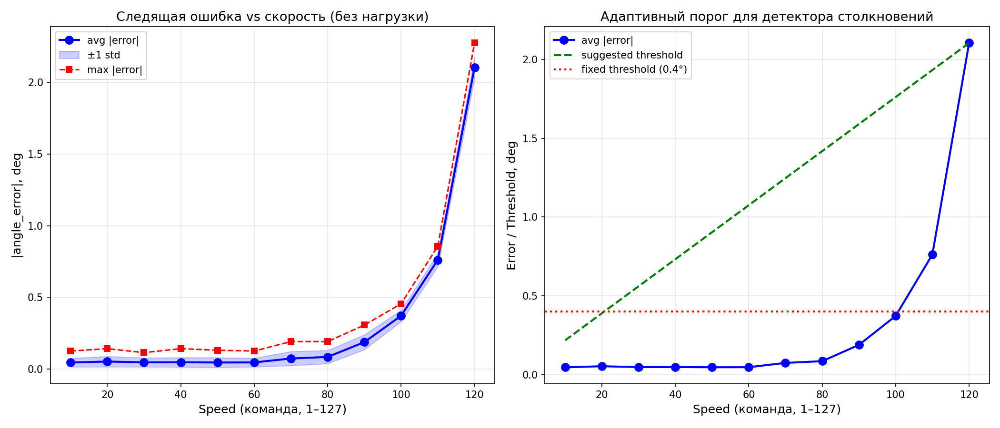
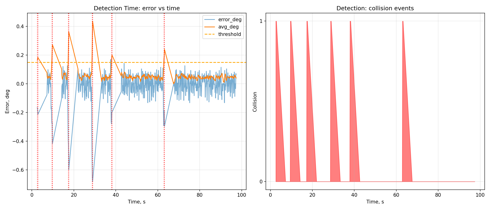

# MKS SERVO42C: Практическое руководство

Полное руководство по работе с замкнутым шаговым двигателем **MKS SERVO42C** через UART.

## Что это

**MKS SERVO42C** — это замкнутый шаговый двигатель со встроенным энкодером и драйвером.
Он умеет:
- Не терять шаги при перегрузке (замкнутый контур).
- Работать тихо и холодно (FOC-алгоритм).
- Общаться с компьютером через UART (RS-485 / TTL).
- Обнаруживать столкновения без внешнего датчика усилия.

## Что в этом руководстве

1. **Подключение** — как соединить двигатель, адаптер и компьютер.
2. **Управление** — как отправлять команды через UART.
3. **Калибровка** — как измерить реальные обороты.
4. **Детектор столкновений** — как обнаружить касание вала.
5. **Адаптивный порог** — как избежать ложных срабатываний.
6. **Detection time** — как измерить время реакции.

## Быстрый старт

### 1. Подключение

| Адаптер USB-TTL | → | Двигатель |
|-----------------|-----|-----------|
| GND | → | GND |
| TX | → | RX |
| RX | → | TX |

**Внимание:** питание 12–24В подаётся **отдельно** на драйвер.

### 2. Установка

```bash
git clone https://github.com/ВАШ_ЛОГИН/mks-servo42c-research.git
cd mks-servo42c-research
mkdir build && cd build
cmake ..
cmake --build .
```

### 3. Первый запуск

```bash
# Linux
./02_read_params /dev/ttyUSB0

# Windows
.\02_read_params.exe COM7
```

## Результаты

### Калибровка скорости

| Speed | RPM |
|-------|-----|
| 10 | 68.5 |
| 60 | 97.8 |
| 120 | 838.0 |


### Следящая ошибка

| Speed | avg\|error\| |
|-------|--------------|
| 10 | 0.046° |
| 60 | 0.047° |
| 110 | 0.762° |
| 120 | 2.104° |



### Detection time

| Параметр | Значение |
|----------|----------|
| Detection time | ~119 мс |
| Ложных срабатываний | 0 |



## Структура проекта

- `docs/` — документация (пошаговые инструкции)
- `src/` — библиотека на C++
- `examples/` — примеры кода
- `tools/` — Python-утилиты для анализа
- `data/logs/` — экспериментальные данные

## Лицензия

MIT
